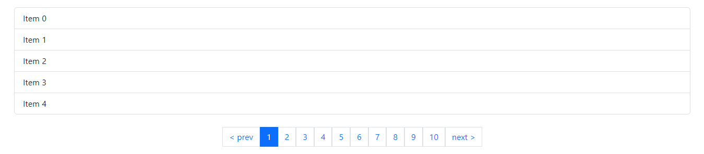

# Easy Pagination JS

A simple library for pagination, compatible with Bootstrap.

Check my website [here](https://wilfredopaiz.com/).

## Demo

Check this Demo [here](https://wpayze.github.io/easyPagination/).


## Example

Import the file

```html
<script src="./easyPagination.js"></script>
```

Add a div for the items, and one for the pagination buttons.

```html
<div id="list"></div>
<div id="pagination"></div>
```

Create some example items.

```js
const items = [
  "item 1",
  "item 2",
  "item 3",
  "item 4",
  "item 5",
  "item 6",
  "item 7",
  "item 8",
  "item 9",
  "item 10",
];
```

Create the pagination object

```js
const paginationOptions = {
  items,
  rows: 5,
  buttonsWrapper: "#pagination",
  handlePaginatedItems: (items) => {
    const list = document.getElementById("list");
    list.innerHTML = "";
    items.forEach((item) => {
      list.innerHTML += `<div>${item}</div>`;
    });
  },
};
```

Call `easyPagination` and execute `paginate()`

```js
easyPagination(paginationOptions).paginate();
```

Or you can create a `pagination` object to call different methods.

```js
  const pagination = easyPagination(paginationOptions);
  pagination.paginate();
  pagination.changeRows(50);
```

**Note: you can import Bootstrap CDN for pagination buttons to look nice.**

## Methods

| Syntax         | Parameters                                        | Description                                                      | Example                     |
| -------------- | ------------------------------------------------- | ---------------------------------------------------------------- | --------------------------- |
| `paginate()`   | `page` (default: 1), `loadButton` (default: true) | Paginates the items and creates the buttons (by default).        | `pagination.paginate()`     |
| `next()`       |                                                   | Fires the same trigger than the `next >` button.                 | `pagination.next()`         |
| `prev()`       |                                                   | Fires the same trigger than the `< prev` button.                 | `pagination.prev()`         |
| `changeRows()` | `newRows` (default: 10)                           | Paginates again with the rows sent, also re-creates the buttons. | `pagination.changeRows(25)` |

## Available Options

| Syntax                  | Description                                                                                                  | Default Value |
| ----------------------- | ------------------------------------------------------------------------------------------------------------ | ------------- |
| `items`                 | Items to paginate. (Array)                                                                                   |               |
| `rows`                  | Rows per page.                                                                                               | 10            |
| `buttonsWrapper`        | CSS Selector where the buttons where be injected.                                                            |               |
| `handlePaginatedItems`  | Function that receives the paginated items as parameter, if this is null `paginate()` will return the items. |               |
| `buttonsContainerClass` | CSS Class for the buttons container.                                                                         | "pagination"  |
| `buttonClass`           | CSS Class for each button.                                                                                   | "page-link"   |
| `nextClass`             | CSS Class for the "Next" button.                                                                             | "page-link"   |
| `prevClass`             | CSS Class for the "Prev" button.                                                                             | "page-link"   |
| `nextText`              | Text for the "Next" button.                                                                                  | "next >"      |
| `prevText`              | Text for the "Prev" button.                                                                                  | "< prev"      |
| `activeClass`           | CSS Class for the current pagination button.                                                                 | "active"      |
